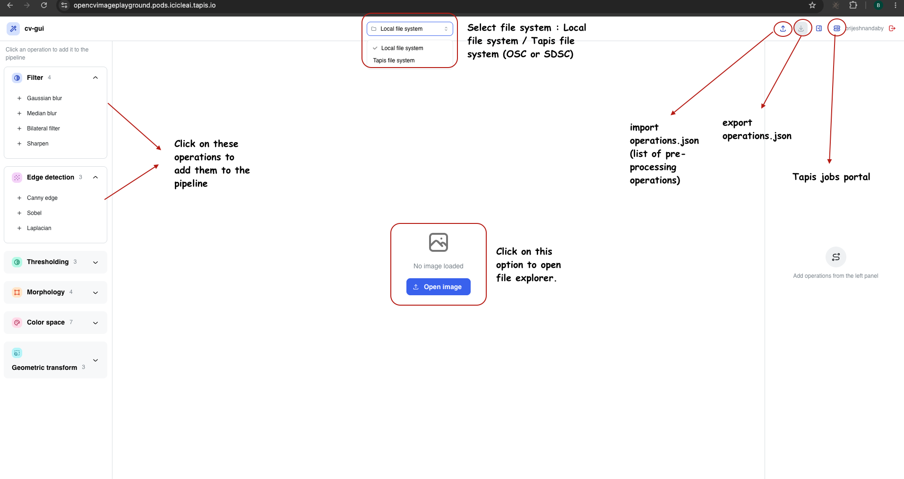
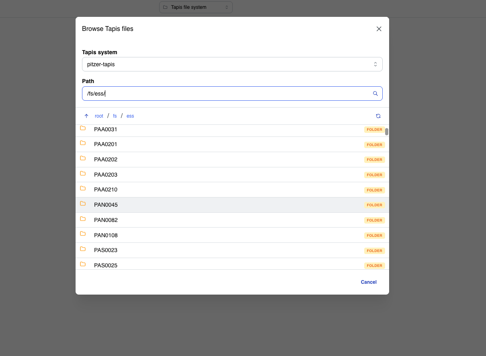
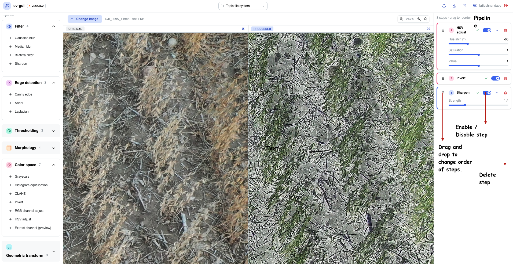
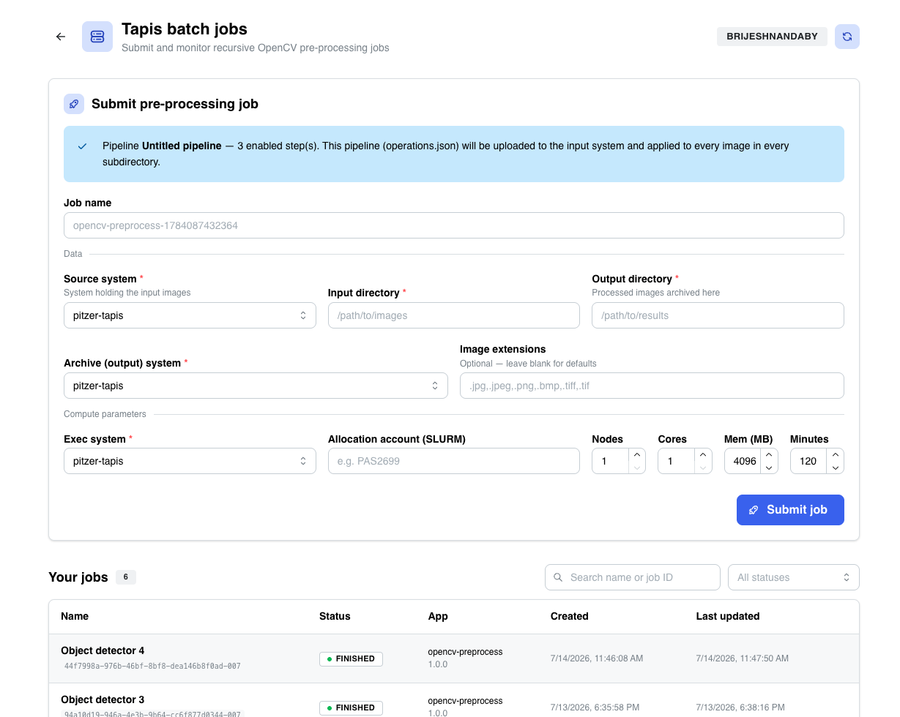

# No-Code Image Lab (Image Pre-processing Studio)

A browser-based OpenCV pipeline builder: build an image pre-processing
pipeline in an interactive editor with live preview, then run it at scale as
a Tapis batch job over every image in a folder tree — or standalone via CLI
or container.

**Tags:** CI4AI, Visual-Analytics, Software

### License

[](LICENSE)

<!-- Add any other licenses you want to include. -->

## References

- [Tapis Jobs API](https://tapis-project.github.io/live-docs/?service=Jobs) — the HPC job submission service used for batch runs.
- [SETUP.md](SETUP.md) — install, configuration, and deployment.
- [packages/core/src/registry.ts](packages/core/src/registry.ts) — TypeScript operation registry (editor/CLI parity).
- [packages/opencv-executor/opencv_executor/ops.py](packages/opencv-executor/opencv_executor/ops.py) — Python operation implementations.

## Acknowledgements

<!-- Please include other funding sources above this line. -->

*National Science Foundation (NSF) funded AI institute for Intelligent Cyberinfrastructure with Computational Learning in the Environment (ICICLE) (OAC 2112606)*

## Issue reporting

Please report issues via [GitHub Issues](https://github.com/ICICLE-ai/opencv-image-playground/issues).

---

# Tutorials

## Build a pipeline (editor)

[Open the app](https://icicleai.tapis.io/#/no-code-image-lab).



1. **Open an image** — click *Open image* (local file, or the Tapis file browser
   once signed in).
   
2. **Add operations** — from the left panel, click ops to append them. They're
   grouped and colour-coded by category (filter, edge, threshold, morphology,
   colour, geometry, denoise).
3. **Tune & reorder** — expand a step to edit its parameters; drag the handle to
   reorder; toggle a step off to skip it. The right pane shows *Original* vs
   *Processed* live (zoom/pan supported).
   
4. **Save / load** — the header ⭱/⭳ icons import and export `operations.json`.

The pipeline is remembered automatically and carried over to the `/jobs` page.

## Run as a Tapis batch job

Requires Tapis to be configured (see [SETUP.md](SETUP.md)) and the
`opencv-preprocess` app registered against a built `preprocess.sif`.

### Sign in

If you already have a Tapis session (an `X-Tapis-Token` cookie from another Tapis
app), you're signed in automatically. Otherwise click the Tapis login icon in the
editor header. Then open the **jobs** page (server icon in the header, or `/jobs`).

### Submit a job



Fill the form — the pipeline you built in the editor is uploaded automatically as
`operations.json` — then click **Submit job**. Behind the scenes the app uploads
the pipeline, then POSTs to `/v3/jobs/submit` server-side (your token never
touches the browser).

When a job reaches `FINISHED`, the processed images (plus a
`preprocess_summary.json` report) are in your **output directory** on the
archive system.

---

# How-To Guides

## The pipeline file (`operations.json`)

```json
{
  "version": "1.0",
  "name": "My pipeline",
  "createdAt": "2026-01-01T00:00:00.000Z",
  "steps": [
    { "id": "a1", "op": "grayscale",     "params": {},            "enabled": true },
    { "id": "b2", "op": "gaussian_blur", "params": { "ksize": 5 }, "enabled": true }
  ]
}
```

Disabled steps are skipped. The same file drives the editor, the CLI, and the
Tapis job.

## Configure a batch job submission

| Field | Meaning |
| --- | --- |
| **Job name** | Optional label (auto-generated if blank). |
| **Source system** | Tapis system holding your input images. |
| **Input directory** | Folder of images — processed **recursively** (all subfolders). |
| **Output directory** | Where processed images are archived (mirrors the input tree). |
| **Archive system** | System the output directory lives on. |
| **Image extensions** | Optional filter, e.g. `.jpg,.png`. Blank = common defaults. |
| **Exec system** | Where the job runs. Determines the queue and working dirs (below). |
| **Allocation account (SLURM)** | Passed as `-A <account>`. |
| **Nodes / Cores / Mem / Minutes** | Compute limits. |

#### System-specific behaviour

The **exec system** you pick changes how the job is submitted:

| Exec system | Queue | Working dirs |
| --- | --- | --- |
| OSC (`pitzer` / `cardinal` / `ascend`) | `cpu` | `/fs/scratch/<account>/harvest_jobs/${JobUUID}` |
| Expanse (`expanse-*`) | `tapisShared` | app defaults (no scratch override) |

## Monitor, search, cancel jobs

The **Your jobs** table lists your `opencv-preprocess` jobs with live status
badges (auto-refreshes while any job is active). You can:

- **Search** by job name or UUID.
- **Filter** by status.
- **Cancel** a running/queued job with the ✕ button.

## Run the pipeline without the app (CLI / container)

The same processing engine runs standalone — handy for local batches or scripts.

### Python CLI

```bash
pip install -e packages/opencv-executor

# single image
opencv-executor run operations.json input.jpg output.jpg

# a flat folder
opencv-executor batch operations.json input_dir/ output_dir/
```

Recursive processing (all subdirectories, mirroring the tree) is what the Tapis
container uses:

```bash
python packages/tapis-job/preprocess.py \
  --input  input_dir/ \
  --output output_dir/ \
  --pipeline operations.json
```

### Container

```bash
apptainer run \
  --bind /data/in:/in --bind /data/out:/out \
  --bind "$PWD/operations.json:/pipeline.json" \
  preprocess.sif --input /in --output /out --pipeline /pipeline.json
```

Config can also come from env vars: `INPUT_DIR`, `OUTPUT_DIR`, `PIPELINE_FILE`,
`IMAGE_EXTENSIONS`.

---

# Explanation

## Available operations

Filters (Gaussian/median/bilateral blur, sharpen), edges (Canny, Sobel,
Laplacian), thresholding (binary, Otsu, adaptive), morphology (erode, dilate,
open, close), colour (grayscale, equalize, CLAHE, invert, channel/HSV adjust,
extract channel), geometry (resize, rotate, flip), and denoise (fast NL-means).
Full definitions live in [packages/core/src/registry.ts](packages/core/src/registry.ts)
(TypeScript) and [packages/opencv-executor/opencv_executor/ops.py](packages/opencv-executor/opencv_executor/ops.py)
(Python) — the two are kept in sync by op key.
